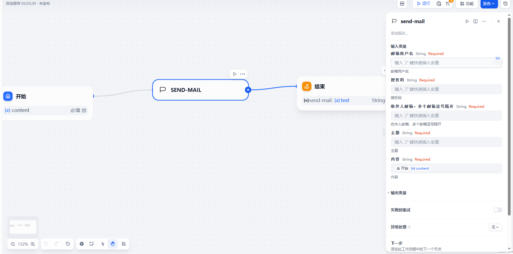
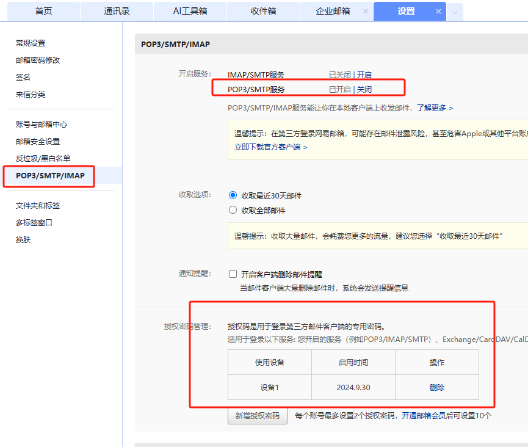

## send-mail

**Author:** wjdsg
**Version:** 0.0.1
**Type:** tool

### Description

By default, the email service of smtp.163.com is used without any data processing. Multiple email recipients can be used, separated by commas in English

How to activate SMTP service and obtain authorization code：

